# TastyTrail
## Pregled projekta
TastyTrail je web aplikacija za istraživanje popularnih restorana, koja omogućava korisnicima da pretražuju restorane, prate njihovu popularnost, ostavljaju recenzije, i čuvaju omiljene restorane.
Sistem koristi različite baze podataka, radi optimizacije različitih delova aplikacije, i omogućavanja bržih i skalabilnijih upita.
## Tehnologije
Frontend: React
Backend: ASP.NET Core Web API
Baze podataka: 
- MongoDB (glavni podaci o korisnicima, restoranima i recenzijama)
- Cassandra (vremenski bazirani podaci vezani za istoriju i nove upite)
- Neo4j (relacije i preporuke)
## Funkcionalnosti
-	registracija i prijava korisnika
- praćenje i pregled drugih korisnika
- prikaz i pregled restorana
- ostavljanje ocena i komentara
- čuvanje restorana
- prikaz popularnih restorana
- prikaz preporučenih restorana, na osnovu različitih kriterijuma
## Pokretanje projekta
1. Backend:
   - otvoriti solution u VS Code-u, ili Visual Studio-u
   - proveriti konekcione stringove u appsettings.Development.json-u (ili appsettings.json-u)
   - pokrenuti baze podataka
   - pokretanje projekta pomoću: dotnet run
2. Frontend:
   - pozicionirati se u tastytrail-frontend folder u cmd-u
   - uneti komande: npm install, zatim npm run dev
## Testiranje
Testiranje API-a je odrađeno pomoću Swagger-a i Postman-a, frontend funkcionalnosti su testirane ručno, sa proverom podataka direktno u bazama podataka.
## Uputstvo za korišćenje
Aplikacija se pokreće na Home stranici, koja zahteva odabir jednog od ponuđenih gradova.
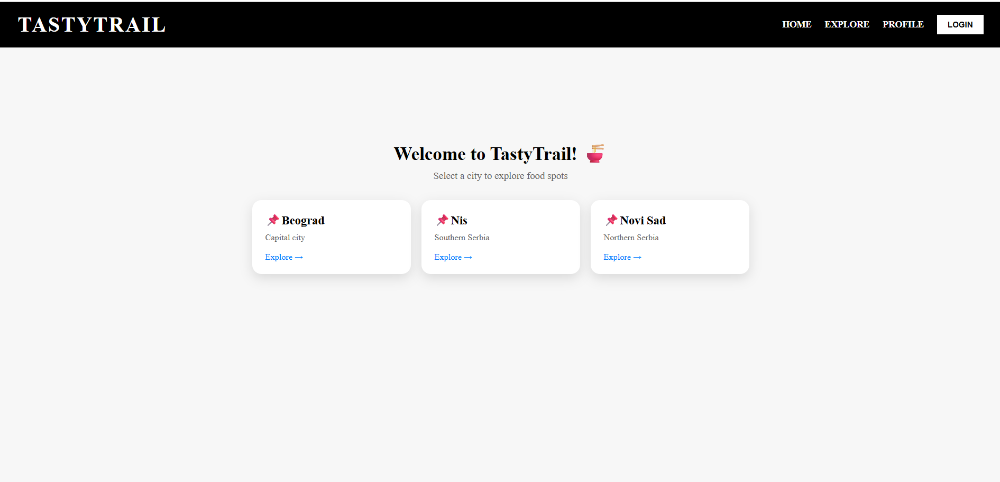
Klik na jednu od ovih kartica, vodi korisnika na explore/city stranu, koja prikazuje restorane koji se nalaze u bazama podataka za određeni grad.
Najpre se proverava da li u bazi podataka postoje restorani za dati grad (Cassandra), i ukoliko ne, restorani se pribavljaju pomoću OpenStreetMap Overpass API-a, za dati grad. Postoji mogućnost da su Overpass serveri zauzeti u određenom trenutku, ali u većini slučajeva podaci o restoranima se pribavljaju, i upisuju sve tri baze podataka.
Izgled stranice odmah nakon što su restorani upisani u baze, i za već postojeće restorane (novi restorani su u Nišu, dok su postojeći u Beogradu):
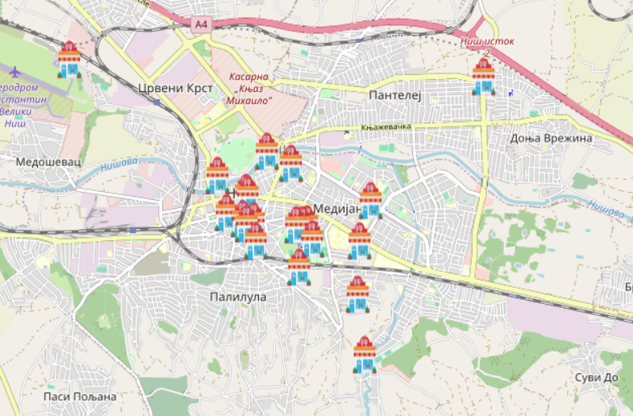
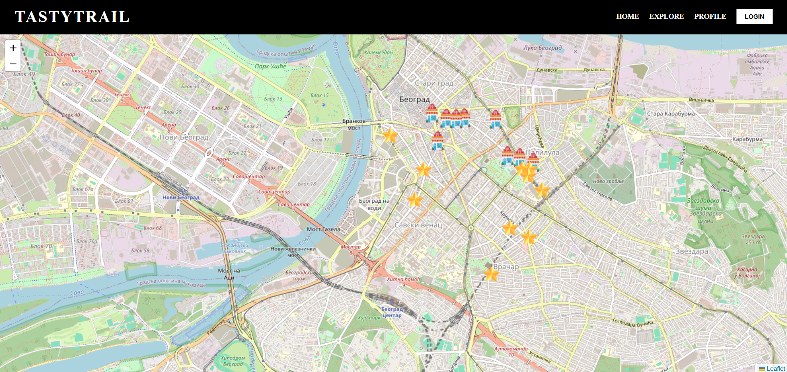
Može se primetiti da korisnik još uvek nije prijavljen. Ukoliko korisnik nema svoj nalog, omogućena mu je registracija, a ukoliko ima, prijava. Dalje je prikazan i izgled tek napravljenog korisničkog profila, koji prikazuje korisničko ime, sliku (koja može da se doda), broj recenzija korisnika, broj pratilaca i broj profila koje on sam prati, mogućnost pretrage korisničkih profila, kao i pregled sačuvanih restorana i recenzija datog korisnika.
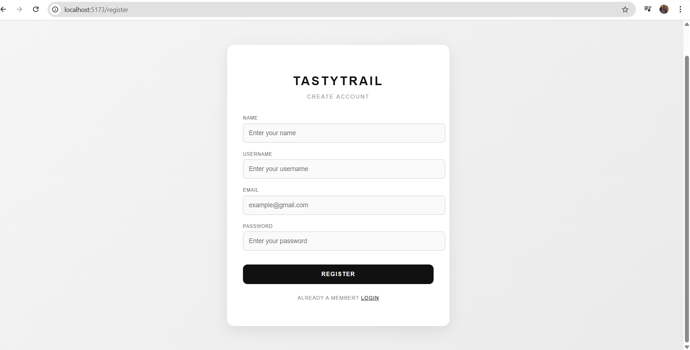
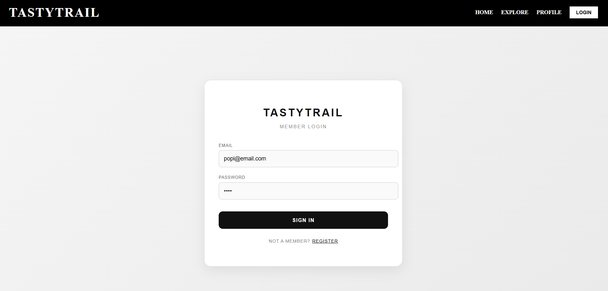
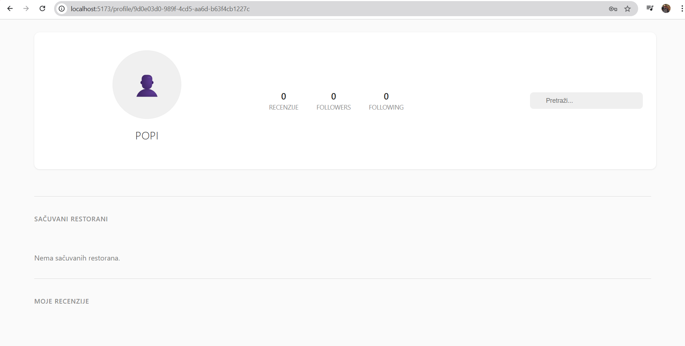
Klikom na sliku avatara, omogućeno je dodavanje i promena profilne slike korisnika.
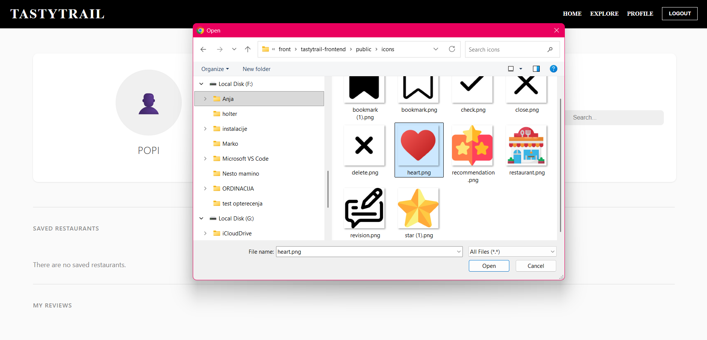
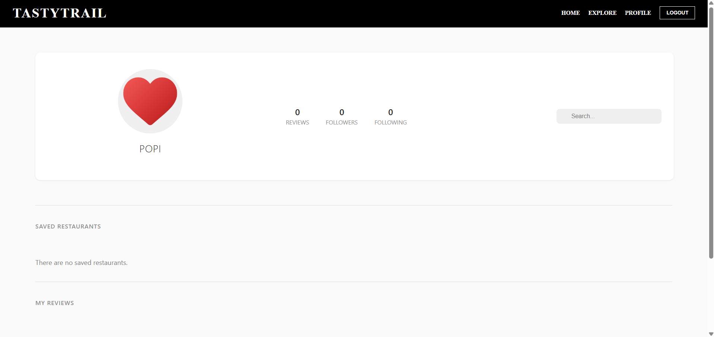
Klikom na Pretraži..., omogućena je pretraga korisnika:
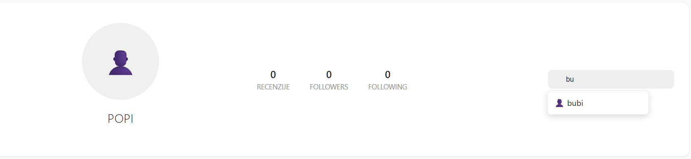
Klikom na rezultat pretrage stižemo do profila traženog korisnika, gde nalazimo opciju follow (ili unfollow), i možemo videti recenzije koje je dati korisnik ostavio. Klikom na dugme follow (Neo4j), vrši se praćenje korisnika, a unfollow, se poništava ta veza.
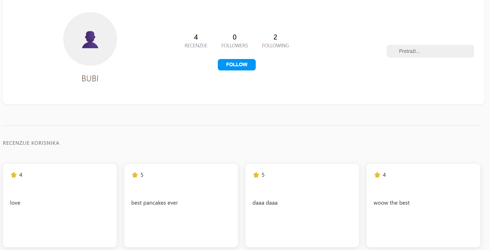
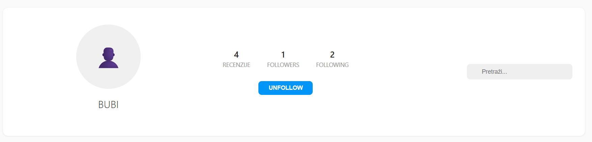
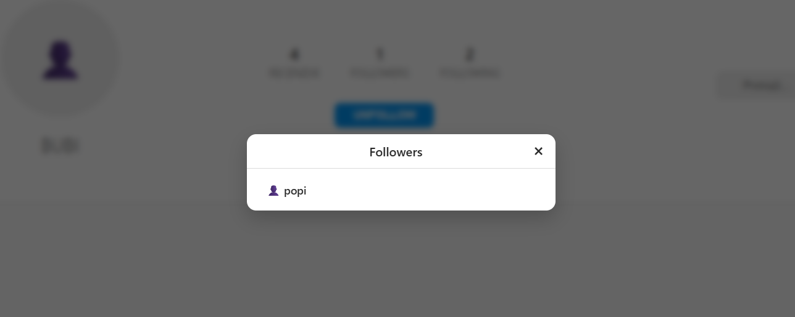
Na profilu ulogovanog korisnika sada može da se vidi da ima 0 pratilaca, ali da prati 1 osobu:

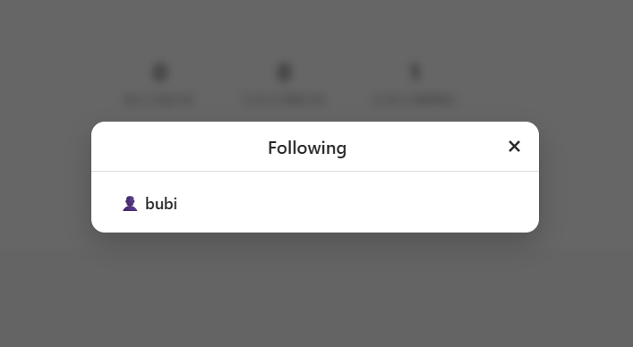
Pošto je korisnik sada ulogovan, za početak, izgled mape se menja. Ikonice zgrada predstavljaju oznake restorana, ikonice zvezdica predstavljaju oznaku restorana u trendu za dati mesec, dok ikonica sa tri zvezdice označava oznaku preporučenog restorana datom korisniku. Trending se određuje na osnovu angažmana prema restoranima. U obzir se uzima koliko puta je restoran pregledan, kakva mu je srednja ocena, da li raste ili opada sa novim recenzijama, koliko ljudi je sačuvalo dati restoran, i na osnovu tih vrednosti, računa se trending ocena za dati restoran (Cassandra + MongoDB). Preporučeni restorani na osnovu toga da li se korisnicima koje dati korisnik prati dopada određeni restoran, da li ga je ulogovani korisnik već posetio, jer njih ne uzimamo u obzir i na osnovu restorana u trendingu (Neo4j + Cassandra + MongoDB).
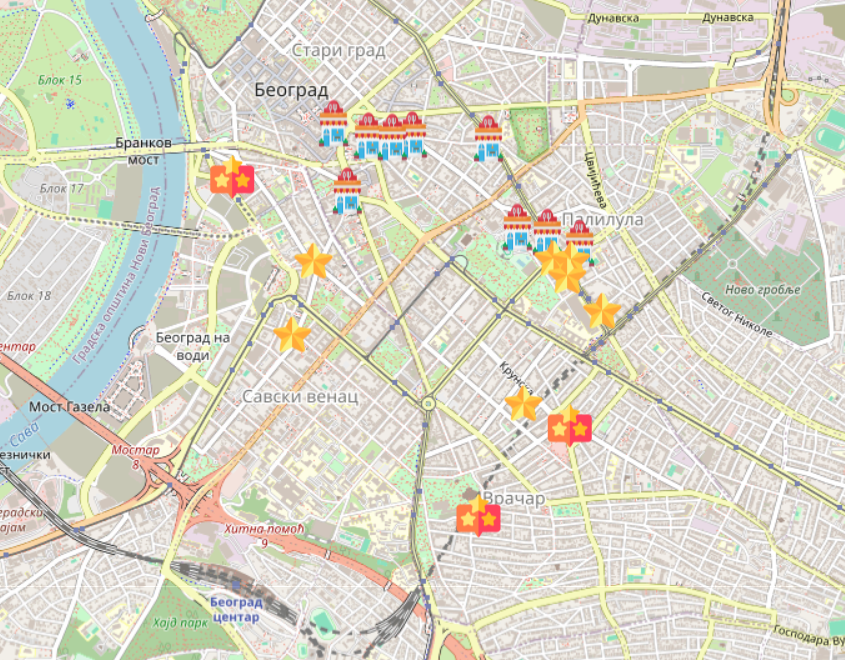
